# UiPath REFramework: Gemini AI Destekli Tasarım Optimizasyonu ve SEO Süreci
Bu proje, Print on Demand iş modeliyle çalışan e-ticaret mağazaları için görsel optimizasyon ve SEO isimlendirme süreçlerini otomatize etmek amacıyla tasarlanmıştır. Tasarımların seri üretimine odaklanan sistem, manuel iş yükünü azaltarak hızlı, SEO uyumlu ve baskıya hazır ürünler elde edilmesini sağlar.

Teknik olarak UiPath REFramework mimarisiyle Dispatcher ve Performer modülleri halinde çalışan arka plan robotu; ham görselleri Python motoruyla 300 DPI çözünürlüğüne yükseltir. Ardından Gemini yapay zeka servisini kullanarak tasarımları analiz eder ve arama motorlarına uygun dosya isimleri üretir. Süreç, işlem sonuçlarının Excel raporuna dönüştürülüp Gemini analiz özetiyle birlikte otomatik e-posta olarak iletilmesiyle tamamlanır.

## 🎯 Projenin Amacı

Bu proje, Print-on-Demand iş modeliyle çalışan e-ticaret mağazaları için görsel optimizasyon, SEO isimlendirme ve raporlama süreçlerini otomatize etmek amacıyla tasarlanmıştır. Tasarımların seri üretimine odaklanan bu sistem, manuel iş yükünü azaltarak hızlı, arama motoru uyumlu ve baskıya hazır ürünler elde edilmesini sağlar.

Projenin temel hedefleri şunlardır:
* **Baskı Standardı Optimizasyonu:** Ham görsellerin Python motoru kullanılarak kalitesi bozulmadan baskı standartlarına uygun biçimde 300 DPI çözünürlüğe dönüştürülmesi.
* **Gemini AI Destekli SEO İsimlendirme:** Google Gemini AI servisi aracılığıyla görsellerin analiz edilmesi ve arama algoritmalarına tam uyumlu dosya isimlerinin üretilmesi.
* **Şeffaf Takip ve Raporlama:** İşlem sonuçlarının günlük Excel takip raporuna işlenmesi, Gemini özet analizi çıkartılması ve GSuite üzerinden ilgili alıcılara otomatik e-posta gönderilmesi.

## 🛠️ Kullanılan Teknolojiler
UiPath Studio, UiPath Orchestrator, Python 3.12.

### Uygulama ve Sistem Arayüzleri
* **Python Motoru:** Performer projesi tarafından UiPath Python aktiviteleri kullanılarak çağrılır ve görsellerin baskı standartlarına uygun biçimde 300 DPI çözünürlüğe dönüştürülmesini sağlar.
* **Gemini Yapay Zeka Servisi:** Performer projesinde ilgili iş akışına Content Generation aktivitesi eklenir ve bu aktivite içerisinden Orchestrator üzerinde tanımlanan Connections bağlantısı seçilir. Görsellere uygun SEO isimlerinin üretilmesi ve gün sonu kısa rapor özetinin çıkartılması bu sayede gerçekleştirilir.
* **Microsoft Excel:** Performer projesinin gün sonu işlem sonuçlarını arka planda otomatik olarak şablon dosya üzerinden güncelleyip takip raporuna dönüştürmesi için kullanılır.
* **GSuite E-Posta Servisi:** Süreç sonunda hazırlanan Excel raporunun ve kısa Gemini özetinin ilgili kişilere iletilmesi için Orchestrator üzerindeki Gmail Connections ve dahili UiPath aktiviteleri kullanılır.

## ⚙️ Süreç Akışı ve Sistem Mimarisi (Workflow)

Süreç, REFramework mimarisiyle verileri toplayan Dispatcher ve verileri işleyen Performer olmak üzere iki aşamalı olarak tasarlanmıştır.

### 3.1 Dispatcher Akışı
* Kaynak klasördeki ham görseller taranarak Orchestrator kuyruğuna işlem bileti olarak eklenir.
* Olası erişim ve bağlantı hatalarını anında yakalayabilmek amacıyla ana katmanda bir **Try-Catch** bloğu uygulanır ve kritik durumlarda süreç güvenle sonlandırılır.

### 3.2 Performer Akışı
Performer projesi, REFramework standart yaşam döngüsü adımlarını kullanarak biletleri sırasıyla işler:

#### Hazırlık Aşaması (Init)
* Süreç ayarları, çalışma dizinleri ve motor yolları yapılandırma dosyasından yüklenir.
* Operasyon için gerekli tüm klasörlerin varlığı denetlenir ve eksik dizinler otomatik olarak oluşturulur.
* Şablon Excel dosyası kopyalanarak günün tarihine ait günlük takip raporu hazırlanır.
* Python motorunun sistemde kurulu olduğu doğrulanarak altyapı kontrolü yapılır.

#### Veri Alma Aşaması (Get Transaction Data)
* Kuyruktan gelen biletin dosyası diskte fiziksel olarak doğrulanır ve çalışma klasörüne taşınır.
* Dosya diskte bulunamazsa kontrollü olarak hata fırlatılıp sonraki işleme geçilir.
* İşlem için benzersiz kimlik oluşturulur ve takip alanları loglama altyapısına tanımlanır.

#### İşlem Aşaması (Process)
* Dosyanın uygun formatta olup olmadığı denetlenir ve uygun olmayan veriler elenir.
* Python motoru çalıştırılarak görsel baskı standartlarına uygun biçimde yüksek çözünürlüğe getirilir.
* Yapay zeka servisi kullanılarak görsel analiz edilir ve arama motoru uyumlu yeni dosya adı üretilir.
* Optimize edilen görsel yeni ismiyle nihai hedef klasöre taşınır.

#### Hata Yönetimi ve İzolasyon (SetTransactionStatus)
* İş kuralı veya sistem hatası alan dosyaların sistemde birikmesini önlemek için dosyalar anında istisna klasörüne taşınarak izole edilir.
* Başarıyla tamamlanan işlemlerin yeni dosya adları kuyruk çıktı verilerine işlenir.

#### Kapanış ve Raporlama (End Process)
* Kuyruktaki veriler toplanarak sanal bir rapor tablosu oluşturulur ve günün işlemleri filtrelenir.
* İşlem sonuçları günlük Excel takip raporuna toplu olarak yazdırılır.
* Tablo verileri yapay zekaya gönderilerek gün sonu özet analizi çıkartılır.
* Excel raporu ve yapay zeka özeti e-posta servisi aracılığıyla ilgili alıcılara iletilerek süreç sonlandırılır.

## ✉️ Akıllı Hata Yönetimi ve Raporlama

Süreç boyunca karşılaşılabilecek hatalar ve operasyonun raporlanması REFramework standartlarına uygun olarak yönetilmektedir:

### 1. Hata Yönetimi ve İstisna İzolasyonu
* **System Exception:** Sistem kaynaklı teknik aksaklıkları, erişim ve uygulama hatalarını kapsar. Dispatcher sürecinde ana katmanda yer alan Try-Catch bloğu ile yakalanarak süreç fatal log eşliğinde terminate workflow aktivitesiyle güvenle durdurulur. Performer sürecinde ise Python altyapısının yanıt vermemesi veya sistem donması gibi durumlarda, işlemi yarıda kalan dosya SetTransactionStatus aşamasında otomatik olarak istisna klasörüne taşınır ve süreç sonraki biletle çalışmaya devam eder.
* **Business Exception:** Sistemsel bir çökme olmayan ancak sürecin iş kurallarına uymayan verilerle karşılaşıldığında fırlatılan kontrollü hatalardır. Kuyruktan gelen dosyanın diskte bulunamaması, desteklenmeyen format veya Gemini servisinin isim üretememesi gibi durumlarda tetiklenir. Bu işlemler tekrar denenmez; ana klasörde birikme yapmaması için dosyalar anında istisna klasörüne taşınarak kuyruk statüsü güncellenir.

### 2. Gün Sonu Raporlama ve Mail Bildirimi
* **Excel Arşivleme:** İşlem tamamlanan tüm biletler Get Queue Items ile çekilerek bellek üzerinde sanal bir tabloda toplanır ve gün sonu operasyonel verileri arşiv Excel raporuna toplu olarak işlenir.
* **Gemini AI Özet Analizi:** Günlük işlem tablosu düz metne çevrilerek Gemini modeline iletilir ve süreç genelinde kapsamlı bir özet analiz çıkartılır.
* **GSuite Entegrasyonu:** Hazırlanan fiziksel Excel takip raporu ve Gemini özet metni, GSuite e-posta servisi aracılığıyla hedef alıcılara otomatik olarak gönderilerek süreç güvenle sonlandırılır.

## 🚀 Kurulum ve Çalıştırma

### Adım 1: Sistem Hazırlığı ve Proje Dizinini Oluşturma

* **Gereksinimler:** Sisteminize UiPath Studio ve Python 3.12 kurulu olmalı, UiPath Orchestrator erişimi bulunmalıdır.
* **Projenin İndirilmesi:** GitHub üzerinden projeyi zip formatında indirin veya `git clone` ile yerel diskinize alın.
* **Dizin Kontrolü:** İndirilen proje dizinindeki `02_Source_Code` klasörünü açarak, içerisinde sürecin iki ana bileşeni olan Dispatcher ve Performer klasörlerinin eksiksiz yer aldığını doğrulayın.

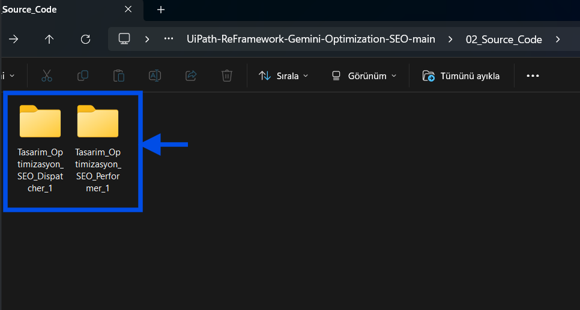

---

### Adım 2: Çalışma Dizinleri ve UiPath Proje Konumlandırması

* **Operasyonel Çalışma Alanı:** Çalışma klasörlerini hazırlayın. İndirilen proje içerisindeki `03_Workspace_Template` klasöründe yer alan `RPA_Workspace` klasörünü doğrudan bilgisayarınızın yerel `C:` ana dizinine kopyalayın. Bu işlem sonucunda oluşacak nihai dosya yolu `C:\RPA_Workspace` olmalıdır.
* **UiPath Proje Dosyaları:** `02_Source_Code` klasörü altındaki Dispatcher ve Performer projelerinin belirli bir dizinde bulunma zorunluluğu yoktur. Bu klasörleri bilgisayarınızda dilediğiniz herhangi bir konumda tutabilir, doğrudan UiPath Studio ile açıp çalıştırabilirsiniz.

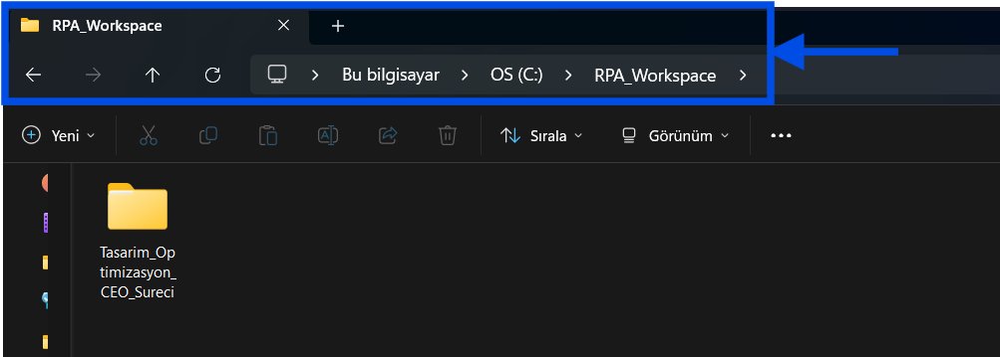

---

### Adım 3: Orchestrator Klasör ve Kuyruk Yapılandırması

* **Çalışma Klasörü:** Orchestrator üzerinde `Tasarim_Projesi` adında veya dilediğiniz farklı bir isimle bir klasör oluşturun ve içine girin.
* **Kuyruk Oluşturma:** Queues sekmesinden **+ Add Queue** butonuna tıklayın. Kuyruk adını `Tasarim_Kuyrugu` veya istediğiniz bir isim olarak belirleyin.
* **Eşleşme Kuralı:** Belirlediğiniz klasör ve kuyruk isimlerinin Config dosyasındaki değerlerle birebir aynı olması gerekir.

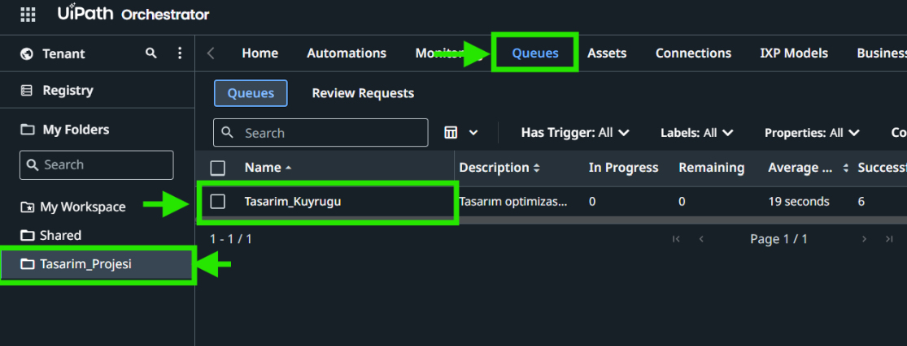

---

### Adım 4: Orchestrator Assets Tanımlanması

Projedeki Config dosyasının dinamik değerleri okuyabilmesi için Assets sekmesinden aşağıdaki değişkenleri `Text` tipinde oluşturun:

* **Disp_02_Raw_Images:** Ham görsellerin taranacağı yerel klasör yolu.
* **Disp_OrchestratorQueueFolder:** Kuyruğun yer aldığı Orchestrator klasör adı.
* **Disp_OrchestratorQueueName:** Oluşturulan kuyruğun adı.
* **Perf_HedefMailAdresi:** Raporların iletileceği yetkili e-posta adresi.
* **Perf_Gemini_Prompt:** Yapay zekaya gönderilecek ana SEO komut metni.
* **Perf_Gemini_Ozet_Prompt:** Gün sonu raporları için özetleyici komut metni.

> Not: Gemini prompt alanları için aşağıdaki örnek metinleri kullanabilirsiniz:
> * **Perf_Gemini_Prompt Değeri:** Bu görseli analiz et ve kurallara göre SEO uyumlu bir dosya ismi öner: Tasarımda geçen yazıyı tam kullan, sonuna retro-groovy ekle, kelimeleri sadece tire ile ayır ve sonuna png uzantısı koy. Sadece dosya adını döndür, başka açıklama yazma.
> * **Perf_Gemini_Ozet_Prompt Değeri:** Tabloyu inceleyerek toplam, başarılı ve hatalı işlem sayılarını içeren kısa bir işlem özeti ile hata durumunu özetleyen bir bilgilendirme metni oluştur.

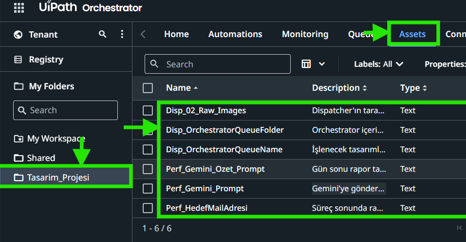

---

### Adım 5: Performer Config Ayarları Yapılandırması

`Data\Config.xlsx` dosyasında **Assets** sayfasına geçin:

* **C2:** Tırnaklar dahil metni silip Orchestrator klasör adınızı yazın.
* **C3:** Tırnaklar dahil metni silip Orchestrator klasör adınızı yazın.
* **C4:** Tırnaklar dahil metni silip Orchestrator klasör adınızı yazın.

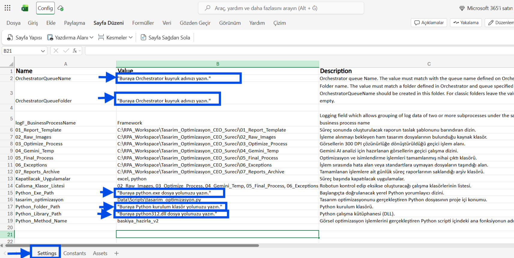

`Data\Config.xlsx` dosyasında **Settings** sayfasına geçin:

* **B2:** Tırnaklar dahil metni silip Orchestrator kuyruk adınızı yazın.
* **B3:** Tırnaklar dahil metni silip Orchestrator klasör adınızı yazın.
* **B15:** Tırnaklar dahil metni silip bilgisayarınızdaki `python.exe` dosya yolunu yazın.
* **B17:** Tırnaklar dahil metni silip Python ana kurulum klasörü yolunu yazın.
* **B18:** Tırnaklar dahil metni silip `python312.dll` dosya yolunu yazın.

---

### Adım 6: Orchestrator Bağlantılarının Yapılandırılması

E-posta iletimi ve yapay zeka süreçlerinin çalışabilmesi için gerekli bağlantıları tanımlayın:

* **Klasör Seçimi:** Sol tarafta bulunan My Folders bölümünden proje klasörünü seçin.
* **Menü Erişimi:** Üst menüde yer alan Connections sekmesine tıklayın.
* **Gmail Bağlantısı:** Gmail bağlayıcısını ekleyin, yetkilendirmeyi tamamlayın ve durumun Connected olduğunu doğrulayın.
* **GenAI Bağlantısı:** UiPath GenAI Activities bağlayıcısını ekleyin, bağlantıyı kurun ve durumun Connected olduğunu doğrulayın.

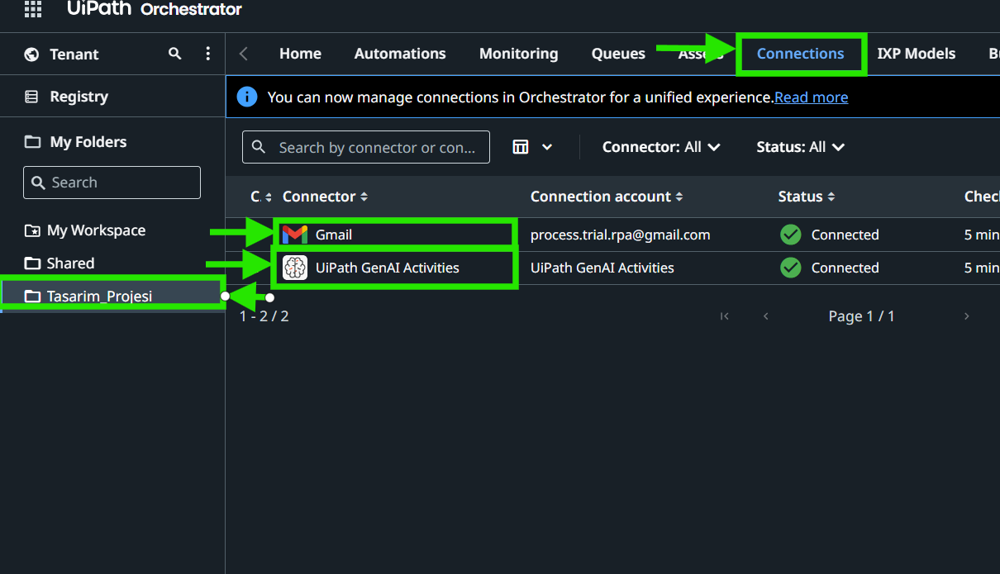

---

### Adım 7: Dispatcher ve Performer Akışlarının Yürütülmesi

Sürecin doğru işlemesi için adımları belirtilen sırayla yürütün:

1. **Ham Görselleri Yükleme:** İşlenecek tasarım dosyalarını `C:\RPA_Workspace\Tasarim_Optimizasyon_CEO_Sureci\02_Raw_Images` klasörüne kopyalayın.
   
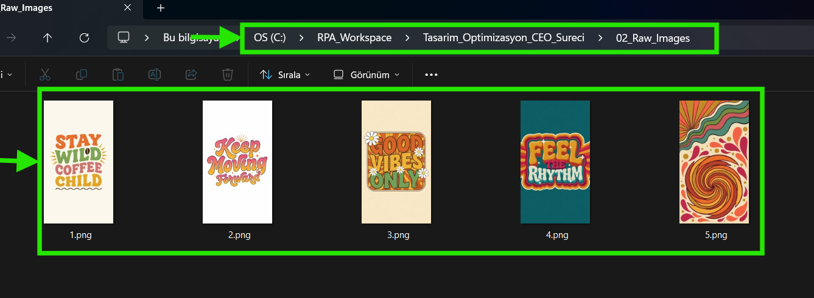

2. **Dispatcher Projesini Çalıştırma:** UiPath Studio üzerinden Dispatcher projesini açıp çalıştırın. Robot, klasördeki görselleri tarayarak Orchestrator üzerindeki kuyruğa ekler.
   
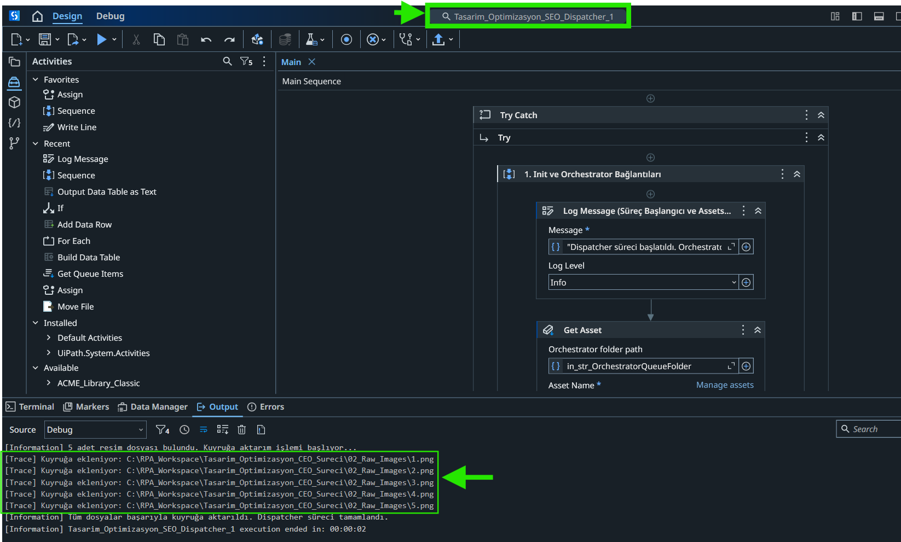

3. **Dispatcher Kuyruk Kontrolü:** Dispatcher tamamlandıktan sonra kuyruğa aktarılan verilerin durumunu kontrol edin. Bekleyen işlemler "New" durumunda olmalıdır.
   
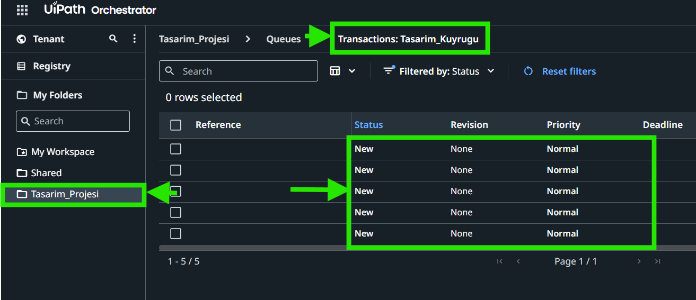

4. **Performer Projesini Çalıştırma:** Dispatcher tamamlandıktan sonra Performer projesini çalıştırın. Robot kuyruktaki ögeleri çeker, Python ile görselleri optimize eder, Gemini ile SEO isimlendirmelerini tamamlar ve sonuç raporunu ilgili e-posta adresine gönderir.
   
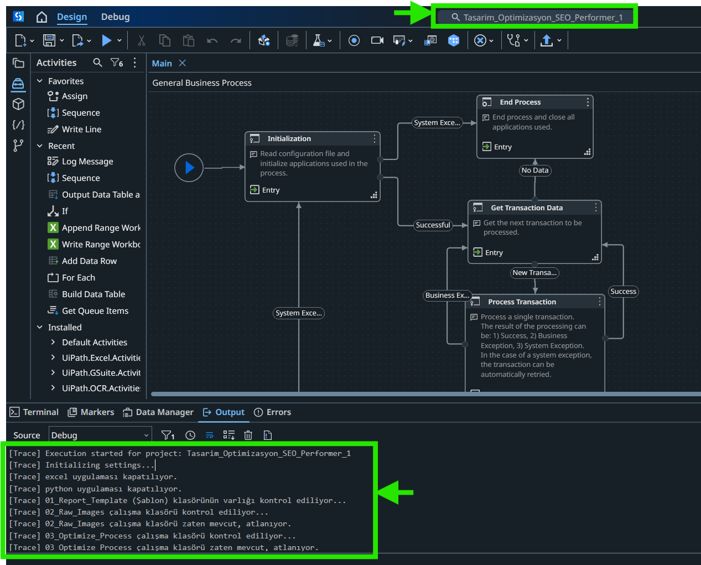

---

### Adım 8: İşlem Çıktıları

Süreç sonu elde edilen çıktılar:

* **Orchestrator Kuyruk Durumu:** Orchestrator üzerindeki kuyruk ekranında işlenen kayıtlar yer alır. Tamamlanan tasarımlar Successful durumuna geçer. Akışı tamamlanamayan kayıtlar In Progress durumunda kaldığı için henüz hata statüsüne geçmez ve bu nedenle istisnalar klasörüne taşınmaz.

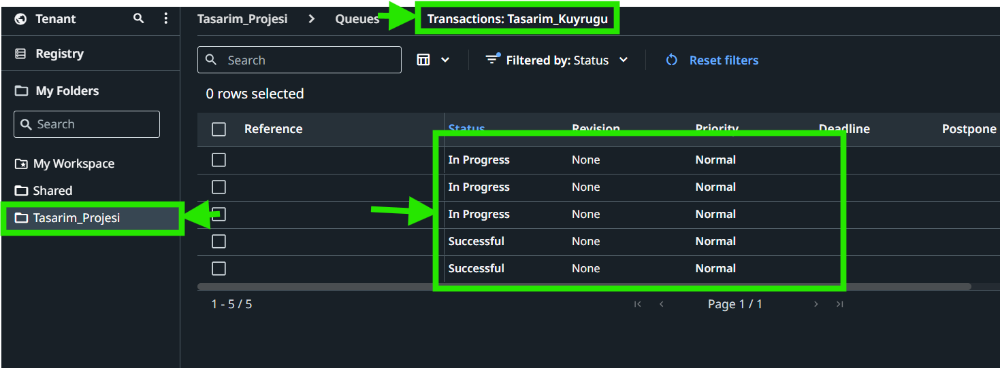

* **Nihai Çıktı Klasörü:** `C:\RPA_Workspace\Tasarim_Optimizasyon_CEO_Sureci\05_Final_Process` dizininde optimize edilmiş ve adlandırılmış tasarımlar bulunur.

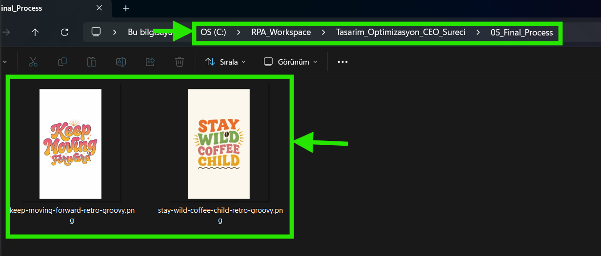

* **Süreç Raporu:** Belirtilen yetkili e-posta adresine özet tabloyu içeren bilgilendirme iletisi ulaşır.

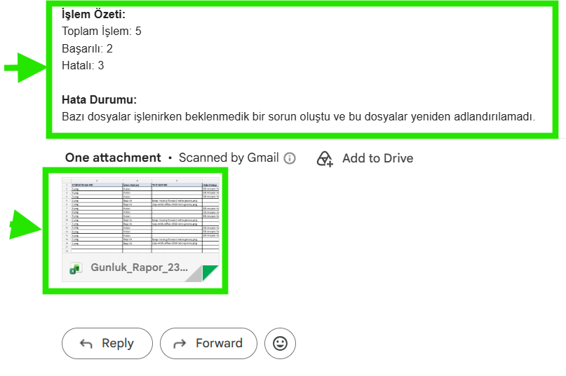

## ✨ Gelecek Planları (Roadmap)

* **Farklı Boyutlandırma Seçenekleri:** Tasarımların 16:9, kare (1:1) veya dikey (9:16) gibi farklı ölçülere otomatik ayarlanması.
* **Otomatik İstisna Kurtarma:** İşleme takılan veya boyut sınırını aşan görsellerin otomatik küçültülerek kuyruğa yeniden dahil edilmesi.